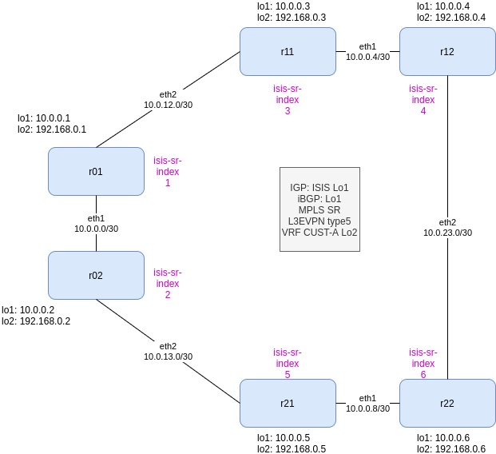
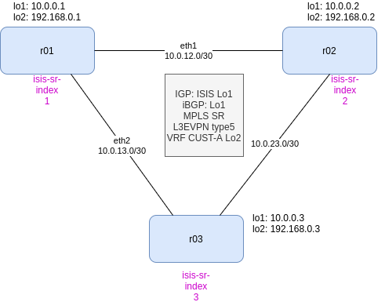

# Table of Contents
   * [Intro](#intro)
   * [Installation](#installation)
   * [Arista cEOS](#arista-ceos)
   * [Hardware](#hardware)
   * [MPLS SR](#mpls-sr)
      * [Issues](#issues)
   * [Nornir](#nornir)
      * [cEOS Docker Issue](#ceos-docker-issue)
   * [TEXTFSM](#textfsm)
   * [Netbox](#netbox)
   * [Ansible](#ansible)
      * [Ansible Troubleshooting](#ansible-troubleshooting) 
   * [Jinja2](#jinja2)
   * [Openconfig](#openconfig)
   * [To-Do](#to-do)
   * [Diagrams](#diagrams)
   * [Other](#other)

# Intro

Use docker-topo to build some network topologies using Arista cEOS (mainly MPLS SR) and test other tools like ansible, napalm, nornir, batfish, netbox, etc. Other topologies in my list are leaf-spine, Route-Reflectors, etc

# Installation

I am using docker-topo from https://github.com/networkop/docker-topo to build the lab and the script ceosctl from https://github.com/etedor/ceos-lab-box to run some commands in all devices.

So for getting docker-topo to work, follow the instructions from the original repo.

First time:

```
pyenv local 3.7.3
python3 -m pip install virtualenv
python3 -m virtualenv ceos-testing; cd ceos-testing
source bin/activate  /// to exit: $ deactivate
pip install git+https://github.com/networkop/docker-topo.git
-- clone this repo ---
git clone https://github.com/thomarite/mpls-sr-ceos.git mpls-sr
cd mpls-sr/topology
docker-topo --create ring.yml --> start-up topology
docker ps -a
docker-topo -s ring.yml   --> save config
docker-topo --create ring.yml --> destroy topology
deactivate
```

Afterwards:

```
cd ceos-testing
source bin/activate
cd mpls-sr/topology
docker-topo --create ring.yml
docker ps -a
```

# Arista cEOS

You will need to create an account in arista.com (it is free) to downloand the cEOS images. I am using 4.23.3M

# Hardware

My laptop (2015) is running Debian 10 Testing, Intel i7 and 8GB RAM. It struggles a bit with the 6 containers running so I am using the 3-node topology.


# MPLS SR

Most of the topologies are MPLS Segment Routing using ISIS as IGP and EVPN for providing a L2/3 VPN.

More details: https://blog.thomarite.uk/index.php/2020/05/25/mpls-segment-routing-arista-lab/

### Issues

 - Need to disable all PIM processes ==> constant cores  -> can't run config, save config etc
 - mtu only 1500 -> isis doesnt come up --- I was expecting to be able to run jumbo frames... I am so naive...
 - show isis neighbor command fails but the routing shows the prefixes so it works under the hood.
 - can't ping inside the L3VPN. I think it is something related to the broadcast of ARPs :( ==> Actually, MPLS Data Plane doesnt work in cEOS. You need to try vEOS and be sure you have a ethernet interface in the VRF!!! (Lo or SVI are not enough to bring up properly the VRF at kernetl level - https://eos.arista.com/forum/see-bgp-routes-unable-to-ping/

```
r01#bash
bash-4.2# 
bash-4.2# ip netns exec ns-CUST-A tcpdump -i lo2
tcpdump: verbose output suppressed, use -v or -vv for full protocol decode
listening on lo2, link-type EN10MB (Ethernet), capture size 262144 bytes

^C12:43:03.027590 02:00:00:00:00:00 (oui Unknown) > Broadcast, ethertype ARP (0x0806), length 42: Request who-has 192.168.0.6 tell 192.168.0.1, length 28
12:43:04.028753 02:00:00:00:00:00 (oui Unknown) > Broadcast, ethertype ARP (0x0806), length 42: Request who-has 192.168.0.6 tell 192.168.0.1, length 28
12:43:05.052753 02:00:00:00:00:00 (oui Unknown) > Broadcast, ethertype ARP (0x0806), length 42: Request who-has 192.168.0.6 tell 192.168.0.1, length 28

3 packets captured
3 packets received by filter
0 packets dropped by kernel
bash-4.2# 

```

# Nornir

I am using 2.4.0. In the "nornir" folder you can find a python script "buid-config.py" using nornir to build BGP and ISIS config (via jinja2) and use napalm to push the config. All the inventory is based on the 3-node topology but it is easy to change it to a different one. You need to install the python libraries from requirements.txt

This is the scructure. 

```
├── buid-config.py
├── config.yaml <-------------- nornir config file
├── inventory <---------------- nornir inventoriy files and devices
│   ├── defaults.yaml
│   ├── groups.yaml
│   ├── hosts.yaml
│   └── host_vars
│       ├── r1.yaml
│       ├── r2.yaml
│       └── r3.yaml
├── nornir.log
├── render  <------------------- rendered configs
│   ├── r1
│   │   ├── bgp.txt
│   │   └── isis.txt
│   ├── r2
│   │   ├── bgp.txt
│   │   └── isis.txt
│   └── r3
│       ├── bgp.txt
│       └── isis.txt
├── requirements.txt
└── templates <----------------- jinja2 templates
    ├── eos-bgp.j2
    └── eos-isis.j2
```

This is an example:

```
(testdir2) /testdir2/mpls-sr/nornir master$ python buid-config.py -b isis -c
------------
hostname: r1
task: deploy_config for isis
failed: False
logs: None
changed: False
diff:


------------
hostname: r2
task: deploy_config for isis
failed: False
logs: None
changed: False
diff:


------------
hostname: r3
task: deploy_config for isis
failed: False
logs: None
changed: False
diff:
```

### cEOS - docker issue

I am using cEOS that is a container controlled via docker.
Nornir uses Napalm to connect to the cEOS containers
As cEOS containers relay on my laptop OS and filesystem, there are some commands that fail. It is not a napalm/norninr issue, it is a just a permissions issue between the container and my FS.

I need this hack to be able to write in /mnt/flash although it still throws an error when writing to startup-config (but it writes...)

```
docker# chmod o+w zfs/graph/*/mnt/flash/.checkpoints
docker# chmod o+w zfs/graph/*/mnt/flash  --> I can write on /mnt/flash needed for napalm-commit
```

# TEXTFSM

Under the nornir forlder, I wanted to try TEXTFSM, so I had to download the templates. More info in https://github.com/networktocode/ntc-templates

```
$ cd nornir
$ git clone https://github.com/networktocode/ntc-templates.git ntc-templates
```

Then you need to set an ENV var for TEXTFSM, you can do it via cli/bashr or via the script (my choice in this particular case)

```
$ export NET_TEXTFSM=~/nornir/ntc_templates/templates
$ update your .bashrc with the above line

or 

python:
import os
os.environ['NET_TEXTFSM'] = './ntc-templates/templates'

```

This example it is a nornir task that uses netmiko to send "show ip interface brief" and we receive a structured reply thanks to textfsm.

```
(testdir2) /ceos-testing/nornir master$ python test-textfsm.py 
netmiko_send_command************************************************************
* r1 ** changed : False ********************************************************
vvvv netmiko_send_command ** changed : False vvvvvvvvvvvvvvvvvvvvvvvvvvvvvvvvvvv INFO
[ { 'interface': 'Ethernet1',
    'ip': '10.0.12.1/30',
    'mtu': '1500',
    'protocol': 'up',
    'status': 'up'},
  { 'interface': 'Ethernet2',
    'ip': '10.0.13.1/30',
    'mtu': '1500',
    'protocol': 'up',
    'status': 'up'},
  { 'interface': 'Loopback1',
    'ip': '10.0.0.1/32',
    'mtu': '65535',
    'protocol': 'up',
    'status': 'up'},
  { 'interface': 'Loopback2',
    'ip': '192.168.0.1/32',
    'mtu': '65535',
    'protocol': 'up',
    'status': 'up'}]
...
```
# NetBox

I struggled. All info here:

https://blog.thomarite.uk/index.php/2020/07/07/netbox/

```
/netbox-example$ tree -L 2
.
├── netbox-docker
│   ├── build-functions
│   ├── build-latest.sh
│   ├── build-next.sh
│   ├── build.sh
│   ├── configuration
│   ├── docker
│   ├── docker-compose.test.yml
│   ├── docker-compose.yml         <-- modify ports nginx 8080:8080
│   ├── Dockerfile
│   ├── env                        <-- netbox.env: define NAPALM_USERNAME and NAPALM_PASSWORD
│   ├── initializers
│   ├── LICENSE
│   ├── README.md
│   ├── reports
│   ├── scripts
│   ├── startup_scripts
│   ├── test.sh
│   └── VERSION
├── nornir-napalm-netbox-demo
│   ├── config.yaml              <-- modify url/port
│   ├── data
│   ├── Makefile
│   ├── nornir.log
│   ├── README.md
│   ├── requirements.txt        <-- you will have to remove the version of some packages
│   └── scripts                 <-- modify secrets and python scripts to use your python env
└── venv
    ├── bin
    ├── include
    ├── lib
    └── share
```


# Ansible

Hardwork to get this working with the latest ansible 2.9 and eos modules as most of the examples I was following were failing.

I am not going to discover the fire regarding ansible so not much explanation here

Having the virtualenv enabled, just install ansible with pip

```
(testdir2) /arista/testdir2$ python -m pip install ansible
```

Important files to take into account. 

ansible.cfg -- define where is your inventory (./ansible-hosts in my case)

ansible-hosts -- defintion of your hosts. You can define the user/pass and ports for ssh and https. Taking into account that each device uses a different port.

group_vars/ceoslab.yaml -- You need to define specific vars for using the eapi and the networks_os.

The file structure:

```
/ansible master$ tree 
.
├── ansible.cfg
├── ansible-hosts
├── group_vars
│   └── ceoslab.yaml
└── playbooks
    ├── collect-facts-cli.yaml
    ├── collect-facts-config.yaml
    ├── collect-facts-http.yaml
    ├── collect-routes.yaml
    ├── collect-bgp-status.yaml

```

So I have some basic playbooks to collect facts using SSH and EAPI (recommended to use -vvv for extra logging...) and run commands

```
/ansible master$ ansible-playbook playbooks/collect-facts-http.yaml -vvv
/ansible master$ ansible-playbook playbooks/collect-facts-cli.yaml -vvv
/ansible master$ ansible-playbook playbooks/collect-bgp-status.yaml --limit="r1"
/ansible master$ ansible-playbook playbooks/collect-routes.yaml --limit="r1"
```

One thing I noticed, if you use [eos_command](https://docs.ansible.com/ansible/latest/modules/eos_command_module.html) with transport httpapi, you receive the output in no-json format. Although, if you test anything command in the device eapi browser, you always get the ouput in json. In Arista you can get the output of commands in json just adding "| json". It seems that you can add the option "outout: json" in ansible. A bit more info [here](https://github.com/ansible/ansible/issues/31346) 

Generate and push config. Using jinja templates from nornir folder.

```
/ansible master$ ansible-playbook playbooks/gen-config.yaml --limit="r1"
```

Keep in mind that host_vars is a soft link to nornir:

```
ansible $ ls -ltr | grep host_vars
lrwxrwxrwx 1 x x  29 Jul 16 13:58 host_vars -> ../nornir/inventory/host_vars
```


### Ansible Troubleshooting

After trying to generate and push config using eos_config.

Details [here](https://blog.thomarite.uk/index.php/2020/07/16/ansible-troubleshooting-2)

# Jinja2

Via [blog](https://blog.thomarite.uk/index.php/2020/07/15/jinja2/):

Whitespace control [here](https://ttl255.com/jinja2-tutorial-part-3-whitespace-control/)

[Online parser](https://j2live.ttl255.com/)

# Openconfig

This is an attempto to use openconfig via ansible.

### Get Config

This has been quite hard so far. This simple test "oc-get-interface-info.yaml" to get the interface config via netcong is based on [Anton Karneliuk blog](https://karneliuk.com/2018/08/new-netconf-modules-in-ansible-2-6-examples-for-arista-eos-cisco-ios-xr-and-nokia-sr-os/). One of the best blogs about network automation.

I had to pip install "jxmlease"

```
(testdir2) /ceos-testing/ansible master$ ansible-playbook playbooks/oc-get-interface-info.yml --limit=r1
(testdir2) /ceos-testing/ansible master$ ansible-playbook playbooks/oc-get-interface-info.yml
```

And all files are generated in /tmp:

```
/tmp$ ls -ltr | grep json
-rw-r--r-- 1 tomas tomas 53476 Jul 13 13:53 r1_list_of_schemas.json
-rw-r--r-- 1 tomas tomas 53476 Jul 13 17:45 r2_list_of_schemas.json
-rw-r--r-- 1 tomas tomas 53476 Jul 13 17:45 r3_list_of_schemas.json
-rw-r--r-- 1 tomas tomas 35254 Jul 13 18:11 r2_oc_conf.json
-rw-r--r-- 1 tomas tomas 35254 Jul 13 18:11 r1_oc_conf.json
-rw-r--r-- 1 tomas tomas 35254 Jul 13 18:11 r3_oc_conf.json
-rw-r--r-- 1 tomas tomas 32114 Jul 13 18:11 r2_openconfig_interfaces.json
-rw-r--r-- 1 tomas tomas 32114 Jul 13 18:11 r1_openconfig_interfaces.json
-rw-r--r-- 1 tomas tomas 32114 Jul 13 18:11 r3_openconfig_interfaces.json
```

And in this playbook I had to change the network_os to "default" as "eos" fails. Anton's blog uses "nexus" but it seems you dont have to do that anymore at least in ansible 2.9.

https://docs.ansible.com/ansible/latest/network/user_guide/platform_netconf_enabled.html


### Push Config

This is based on [Anton Karneliuk blog part3 for openconfig via ansible](https://karneliuk.com/2018/08/openconfig-part-3-advanced-openconfig-w-ansible-for-arista-eos-cisco-ios-xr-and-nokia-sr-os-route-policy-bgp-and-interfaces-again/).

In this case I am just following the role created in the blog adapting small things to my env.

Collecting data is fine. It just takes time to get all YANG modules and process them.

```
/ceos-testing/ansible master$ ansible-playbook playbooks/oc-push-config.yaml --limit=r1 --tag=arista_collect -vvv
```

And this is the error when trying to push the interface config. In my case, it is just a new loopback interface with only ipv4.
```
/ceos-testing/ansible master$ ansible-playbook playbooks/oc-push-config.yaml --limit=r1 --tag=arista_configure -vvv

fatal: [r1]: FAILED! => {
    "changed": false,
    "invocation": {
        "module_args": {
            "backup": false,
            "backup_options": null,
            "commit": true,
            "confirm": 0,
            "confirm_commit": false,
            "content": "<nc:config xmlns:nc=\"urn:ietf:params:xml:ns:netconf:base:1.0\" xmlns:oc-if=\"http://openconfig.net/yang/interfaces\" xmlns:oc-ip=\"http://openconfig.net/yang/interfaces/ip\" xmlns:ianaift=\"urn:ietf:params:xml:ns:yang:iana-if-type\" xmlns:if=\"urn:ietf:params:xml:ns:yang:ietf-interfaces\" xmlns:oc-eth=\"http://openconfig.net/yang/interfaces/ethernet\" xmlns:oc-ext=\"http://openconfig.net/yang/openconfig-ext\" xmlns:oc-ift=\"http://openconfig.net/yang/openconfig-if-types\" xmlns:oc-inet=\"http://openconfig.net/yang/types/inet\" xmlns:oc-lag=\"http://openconfig.net/yang/interfaces/aggregate\" xmlns:oc-types=\"http://openconfig.net/yang/openconfig-types\" xmlns:oc-vlan=\"http://openconfig.net/yang/vlan\" xmlns:oc-vlan-types=\"http://openconfig.net/yang/vlan-types\" xmlns:oc-yang=\"http://openconfig.net/yang/types/yang\" xmlns:yang=\"urn:ietf:params:xml:ns:yang:ietf-yang-types\"><oc-if:interfaces><oc-if:interface><oc-if:name>Loopback3</oc-if:name><oc-if:config><oc-if:description>generated via openconfig</oc-if:description><oc-if:enabled>true</oc-if:enabled><oc-if:name>Loopback3</oc-if:name><oc-if:type>oc-if:softwareLoopback</oc-if:type></oc-if:config><oc-if:subinterfaces><oc-if:subinterface><oc-if:index>0</oc-if:index><oc-ip:ipv4><oc-ip:addresses><oc-ip:address><oc-ip:ip>10.0.0.11</oc-ip:ip><oc-ip:config><oc-ip:ip>10.0.0.11</oc-ip:ip><oc-ip:prefix-length>32</oc-ip:prefix-length></oc-ip:config></oc-ip:address></oc-ip:addresses><oc-ip:config><oc-ip:enabled>true</oc-ip:enabled><oc-ip:mtu>1500</oc-ip:mtu></oc-ip:config></oc-ip:ipv4></oc-if:subinterface></oc-if:subinterfaces></oc-if:interface></oc-if:interfaces></nc:config>",
            "default_operation": null,
            "delete": false,
            "error_option": "stop-on-error",
            "format": "xml",
            "host": "r1",
            "hostkey_verify": true,
            "lock": "always",
            "look_for_keys": true,
            "password": "VALUE_SPECIFIED_IN_NO_LOG_PARAMETER",
            "port": 2000,
            "save": false,
            "source_datastore": null,
            "src": null,
            "ssh_keyfile": null,
            "target": "running",
            "timeout": 10,
            "username": "VALUE_SPECIFIED_IN_NO_LOG_PARAMETER",
            "validate": false
        }
    },
    "msg": "parseIdentityref parsed invalid identity openconfig-interfaces:softwareLoopback for leaf node type"
}

PLAY RECAP ******************************************************************************************************************************************************************************************************************************
```
 
I have been trying to play with the base config "./playbooks/roles/openconfig/files/r1_openconfig-interfaces.json" but no joy. I am have used the same config gathered from the "oc-get-interface-info.yam" playbook and it is even worse as jtox fails.

Based on Anton's blog, Arista seems not very interested in Openconfig. As he had problems too. And searching on the internet initially, I only could find good info from Cisco.


As well, while adding the new playbook to my repo, I had to dig a bit in some ansible points like [roles](https://docs.ansible.com/ansible/latest/user_guide/playbooks_reuse_roles.html), [netconf_config module](https://docs.ansible.com/ansible/latest/modules/netconf_config_module.html) to get netconf connection established, [include_vars](https://docs.ansible.com/ansible/latest/modules/include_vars_module.html) as I realised that I had to use relative path to the module or full path,  and [lookup](https://docs.ansible.com/ansible/2.4/playbooks_lookups.html) to realise how to use a var in the path.


This is my final dir tree

```
/ansible master$ tree
.
├── ansible.cfg
├── ansible-hosts
├── group_vars
│   └── ceoslab.yaml
└── playbooks
    ├── collect-facts-cli.yaml
    ├── collect-facts-eapi.yaml
    ├── oc-get-interface-info.yaml
    ├── oc-push-config.yaml
    └── roles
        └── openconfig
            ├── files
            │   ├── r1_openconfig-interfaces.json
            │   ├── r1_openconfig-interfaces.json-NEW
            │   ├── r1_openconfig-interfaces.json-ORIG
            │   ├── r1_openconfig-network-instance.json
            │   ├── r1_openconfig-routing-policy.json
            │   ├── r2_openconfig-interfaces.json
            │   ├── r2_openconfig-network-instance.json
            │   ├── r2_openconfig-routing-policy.json
            │   ├── r3_openconfig-interfaces.json
            │   ├── r3_openconfig-network-instance.json
            │   └── r3_openconfig-routing-policy.json
            ├── tasks
            │   ├── collect.yml
            │   ├── configure.yml
            │   ├── jtox_builder.yml
            │   ├── main.yml
            │   ├── yang_collector.yml
            │   └── yang_configurator.yml
            ├── templates
            │   └── pyang_request_jtox.j2
            └── vars
                └── desired_openconfig_modules.yml
```

# To-Do

To-Dos
 - test batfish
 - test ZTP
 - add some alpine linux boxes to simulate customers, etc.

# Diagrams

All of them have bee done using https://draw.io

This is the ring topoloy (6 devices) - check the topology folder to use if via docker-topo




This is the 3-node topoloy (still a ring :) This is good for testing on your laptop as 6 devices can put a bit of a strain on resources.




# Other

Markdown Cheatsheet: https://github.com/adam-p/markdown-here/wiki/Markdown-Cheatsheet<br>
Table of Contents: https://github.com/ekalinin/github-markdown-toc<br>

Example from EVE-NG on GCP using vEOS

[](https://asciinema.org/a/l57G2ppeejuslQ2FJl4gu3xNx)
