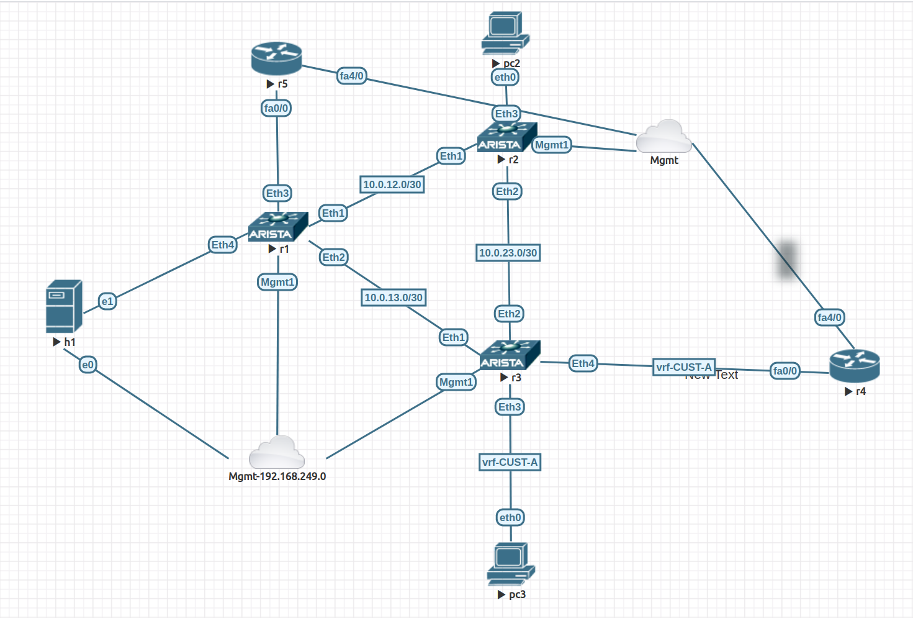

# Intro

These are ramdon scripts.

# bgp-check.py

This script is meant to be copied on an Arista device (cEOS, vEOS, EOS) in "/mnt/flash"

```
[tomas@r1 flash]$ ls -ltr
total 435348
drwxrwx---+ 2 root  eosadmin     16384 Apr 16 21:08 lost+found
-rw-rwx---+ 1 root  eosadmin 445727898 Apr 16 21:08 vEOS-lab.swi
-rw-rwx---+ 1 root  eosadmin        24 Apr 16 21:09 boot-config
drwxrwxr-x+ 2 root  eosadmin      4096 Jun 17 21:42 Fossil
drwxrwxr-x+ 2 root  eosadmin      4096 Jun 17 21:42 fastpkttx.backup
-rw-rw-r--+ 1 admin eosadmin        13 Jun 17 21:44 zerotouch-config
drwxrwx---+ 3 root  eosadmin      4096 Jun 17 21:59 debug
-rw-rw-r--+ 1 root  eosadmin      1846 Jun 30 16:39 SsuRestoreLegacy.log
-rw-rw-r--+ 1 root  eosadmin      1846 Jun 30 16:39 SsuRestore.log
-rw-rw-r--+ 1 root  eosadmin      3003 Jun 30 16:40 AsuFastPktTransmit.log
drwxrwxr-x+ 4 root  eosadmin      4096 Jun 30 18:53 schedule
-rw-rw-r--+ 1 tomas eosadmin       832 Jun 30 19:14 bgp-check.py
-rw-rw-r--+ 1 tomas eosadmin      3477 Jun 30 19:15 startup-config
drwxrwxr-x+ 3 root  eosadmin      4096 Jun 30 19:16 persist
[tomas@r2 flash]$ 
```

Then you need to configure EOS to call the script:

```
r1#show run | grep bgp-check
schedule bgp-check interval 3 timeout 1 max-log-files 10 command bash python /mnt/flash/bgp-check.py
```

The script is install in R1 as per diagram below.

The goal of the script is to detect if in the VRF CUST-A the prefix "192.168.33.1/32" is learnt with the BGP community 1234:5678. If so, the script performs some changes in R1 BGP so that prefix is advertised to another peer R5. 

It wouldnt be too difficult to make the script flexible regarding the prefix, BGP community and VRF.

R1 before detecting the prefix+community
---

R1 after detecting prefix+community
---



